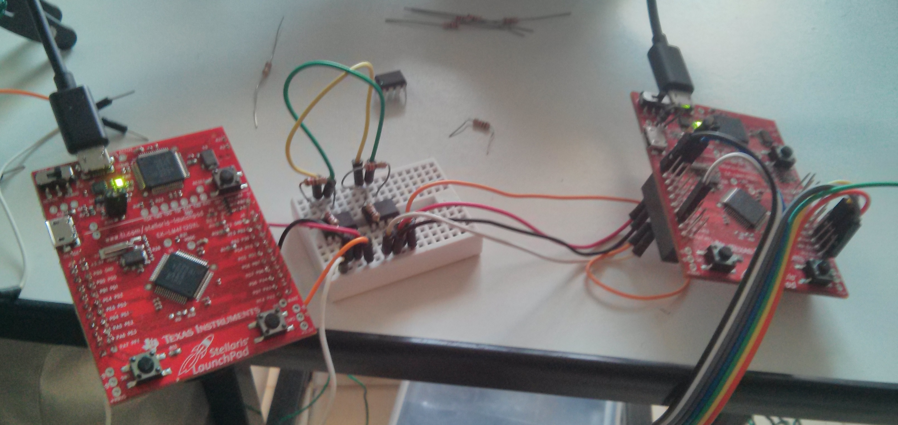
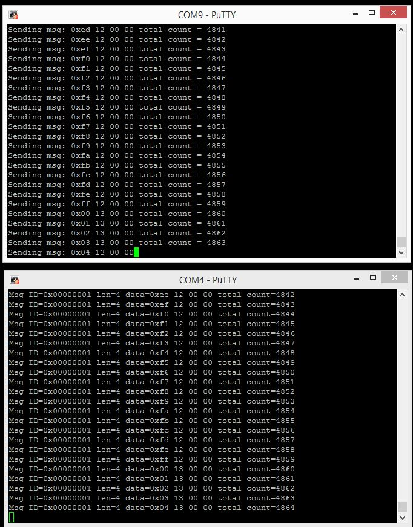

canbus-stellaris
================

Working example of CAN BUS for Stellaris Launchpad (EK-LM4F120XL)
* Install required software tools
* Setup hardware
* Import, Build and Debug Code Composer projects 

Required software tools
=======================

* Code Composer Studio 5.5 (http://www.ti.com/tool/ccstudio)
* StellarisWare 9453 (http://www.ti.com/tool/sw-ek-lm4f120xl)

Required hardware
=================

* 2 x Stellaris Launchpad (EK-LM4F120XL)
* 2 x Microchip MCP2551 (http://www.microchip.com/mcp2551)
* 2 x 1k ohm resistor
* 2 x 120 ohm resistor
* 6 x Breadboard Jumper Cable Wires Male (http://dx.com/s/Jumper+wire+male)
* 1 x Breadboard (http://dx.com/s/breadboard)

Screenshots
===========

Reference hardware setup

Excepted console output ( COM9 is CAN TX / COM4 is CAN RX )

